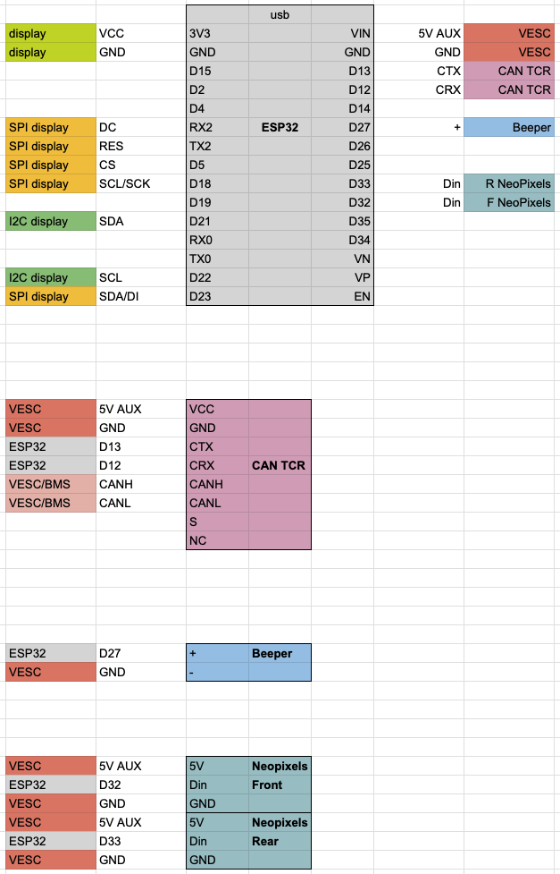

# Balance Buddy ESP32
ESP32 based accessory board for the balance app in BV's BLDC firmware.

Based off Mitch Lustig's balance buddy for arduino nano

## Features
1. Directional LEDs for headlight/taillight with dimming.
1. Buzzer for over speed, low voltage, and high speed half switch warnings.
1. A teeny tiny small display thats so small you cant even see it with data you probbaly wont be able to read (it's smol).
1. It uses CAN bus, so there are NO DOWNSIDES to adding it. JUST DO IT!

## Parts List
1. ESP32
1. CAN transceiver (like the TJA1051)
1. 5v piezo (active or passive) buzzer
1. 2x LED Strips (WS2812 GRB is the default, but anything supported by FastLED should work)
1. SSD1306 128x64 Display (SPI, any color, the blue/yellow works nice too)

# Wiring
## Can Module: 

See config.h for pins

Basically:
* CAN_RX to CRX on the transceiver
* CAN_TX to CTX on the transceiver
* Transceiver VCC and GND to 5v and ground
* Transceiver CANL and CANH to VESC CAN

### 2. Piezo:
**if you use a fancy buzzer/speaker make sure it wont blow the nano**

See config.h for pins

Basically:
* BEEPER_PIN to + on beeper
* Ground to - on beeper

### 3. LEDs:
**if you wire lots of LEDs make sure it wont blow the nano**

See config.h for pins

### 4. SSD1306:

See config.h for pins. SPI preffered, I2C kinda supported (but sloowwwww)

### Wiring overview:

Not a fancy image, but it's accurate:

# Configuration
## Options and pins

All features are specified in config.h

## Compiling/Installing

Just open the project with platformio and click upload

## Updating firmware over Wifi

Set your wifi ssid, password, and device hostname in config.h

Uncomment these 2 lines in platformio.ini
* `upload_protocol = espota`
* `upload_port = (hostname).local` with (hostname) defined in config.h

If hostname doesn't work, set `upload_port` to the ip address of the esp32.

If it can't upload, try power/cycling the device so it reconnects to wifi.

# Why does my balance buddy keep crashing?!!!

Applicable to I2C:

If youre using a display, it is likely related to [bus capacitence](https://hackaday.com/2017/02/08/taking-the-leap-off-board-an-introduction-to-i2c-over-long-wires/) and [wire.h hangs](https://github.com/OpenAgricultureFoundation/openag_brain/issues/236)  
In my case using minimal length wires, and a 2.2k pull up from scl to 3.3v solved my issues.

Using SPI is preferred and fixes this.
